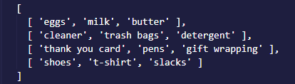

You will need to **FORK** this repository (repo) to your own account.  After you have forked it to your account, you will then need to **CLONE** that repo to your computer.  By doing this, you will be able to work through the challenges and push your code back to your own repo.  All instructions are within each file.  Below details the instructions for both challenges.

*************************************************************************************

**4.2 Input & DOM Manipulation Challenge**

- With the given shoppingList array (within the JS file), use array destructuring to assign each array within the shoppingList array its own variable. Then, reinitialize the shoppingList array so it is a single array containing all of the values from the original array. 

Original Shopping List:

Shopping List after being reinitialized:

    
    - after the shoppingList array has been reinitialized, using the array.prototype.map method, map over the newly initialized shoppingList array. You should do the following within the map method:
        - include a parameter for index
        - utilize the array.prototype.push method to push the current value being mapped over into the appropriate key/value pair in the obj variable
            - you will need to implement some sort of logic to check the index of the current item being mapped over.